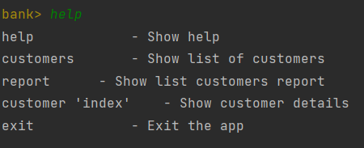
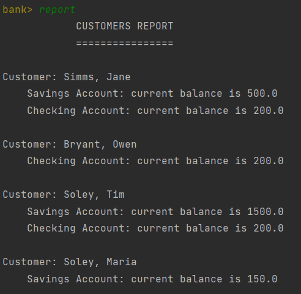
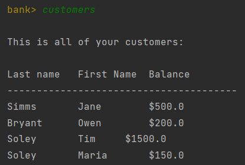
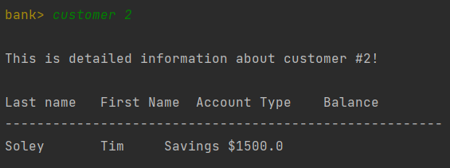

# Вивід можливих команд



# Вивід нової команди "report"



# Вивід списку клієнтів


# Вивід клієнта по індексу


# Метод main()
``` java
public static void main(String[] args) throws IOException {

        File currentClassFile = new File(URLDecoder.decode(CLIdemo.class
                .getProtectionDomain()
                .getCodeSource()
                .getLocation()
                .getPath(), "UTF-8"));
        String classFileDirectory = currentClassFile.getParent();
        DataSource data = new DataSource(classFileDirectory+"\\35-tui-2-Dobrynya69\\test.dat");
        data.loadData();

        CLIdemo shell = new CLIdemo();
        shell.init();
        shell.run();
    }
```

# Новий код в методі run()
``` java
else if ("report".equals(line)) {
    CustomerReport report = new CustomerReport();
    report.generateReport();
}
```
